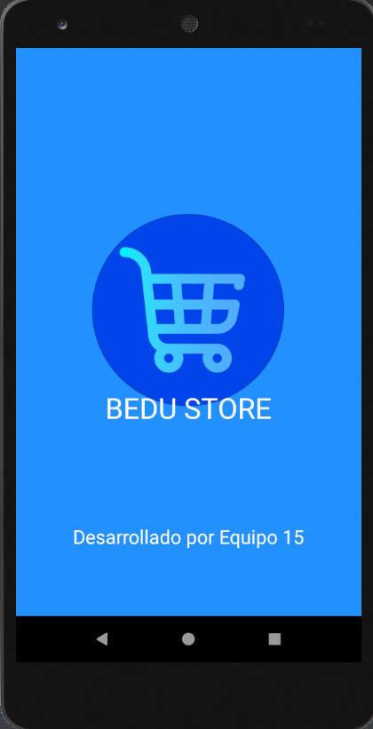
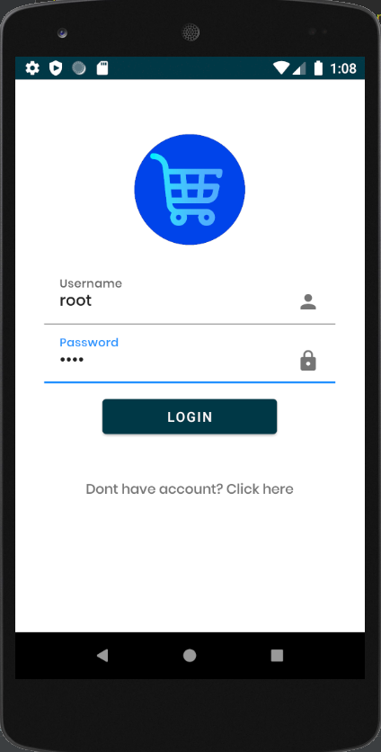
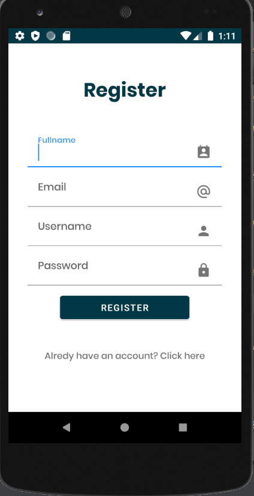

<h1> BEDU STORE </h1>

## ¿Qué es Bedu Store?

Bedu Store es un ecommerce para aplicaciones moviles Android, donde se venden distintos tipos de articulos para hombres, mujeres y niños, en cual iniciando sesion con una cuenta registrada se puede visualizar informacion relevante de los articulos,
explorar la pagina, añadir al carrito, añadir a favoritos, iniciar un proceso de compra y visualizar informacion de la cuenta.

## ¿Cómo funciona Bedu Store?

Al instalar la aplicacion en tu dispositivo movil, esta se veria algo asi entre las demas aplicaciones del mismo con un color azul y como logo un carrito de supermercado:

  

Al ejecutar la aplicacion por primera vez, es decir, cuando comienza el ciclo de vida de la aplicacion esta se veria con una pantalla algo asi

  

Una vez cargada la aplicacion, se le pedirá al usuario que Inicie Sesión con sus credenciales, [Aqui](#credenciales) puedes encontrar esas credenciales para empezar a usar Bedu Store:

  

La vista anterior te da la opción de registrarte pero debido a que no se cuenta con una base de datos para guardar el registro de usuarios por el momento no va a ser posible que un usuario quede registrado en la aplicacion,
ests vista se ve algo asi:

  

En esta vista podrás insertar datos relevantes que seran necesarios para recabar todos los datos mas importantes de los usuarios, como nombre completo, correo electronico, nombre de usuario y contraseña.
 
Una vez ingresadas las credenciales del usuario root se mostrará al usuario la pantalla principal de la aplicacion o pantalla home, en donde el menu superior muestra un menu de busqueda, se presentan la seccion de categorias de la app
que se dividen en hombres, mujeres y niños, hay una slider del publico al que va dirigida la aplicacion y mas abajo hay un apartado de promocionales y publicaciones propias de la aplicación.app

  

Desde esa vista, al dar click a cualquiera de las categorias se mostrará un listado de productos para cada una de las categorias, a continuación se muestran cada unas de las categorias y sus productos correspondientes:
 
### Menu Hombres

  

### Menu Mujeres

  

### Menu Niños

  

Desde cualquiera de las listas de productos de cada una de las categorias existen dos opciones, una es dar click directamente en el icono del corazon, acción que llevará al usuario a la pantalla de Favoritos
en la cual añadirá el producto en una lista donde se marcaran todos los articulos que el usuario quiera dejar fijados como productos para comprar despues, algo asi como una lista de deseos y asi el usuario no pueda
perder de vista sus articulos favoritos para mas tarde añadirlos al carrito o bien, comprarlos.

  

Una vez añadido el producto en la vista de favoritos, el articulo se verá algo así.

  

Regresando a la vista de articulos, si se le da click directamente al producto, llevará al usuario a una pantalla donde se mostraran los detalles del articulo, se mostrará información como fotografias del articulo, calificación,
descripción, costo, se podrá seleccionar la cantidad, se podrán visualizar las especificaciones de las tallas, asi como la visualización de un estimado de dias para la entrega del producto en cuestion.

  

  

Para navegar a traves de la pagina no solo se puede hacer mediante botones que te lleven de un lado a otro en lugares especificos de la app, se cuenta con un menu de navegación entre las vistas mas importantes de la aplicación, entre ellas están las pantallas de home y favoritos, que ya se han mencionado anteriormente, asi como las vistas de mi carrito
y mi cuenta.

  

En la pantalla de mi carrito, el usuario podrá encontrar de manera directa los articulos que haya cargado a este para poder realizar su compra posteriormente. Esta pantalla se muestra a continuación:

  

Desde esta pantalla se pueden realizar algunas acciones tales como borrar los articulos añadidos:

  

  

Tambien desde la vista de mi carrito se puede iniciar un proceso de pago y este se veria tal y como se muestra a continuación:

  

A continuación se muestra otra de las pantallas principales de la aplicación. Esta es la pantalla de Mi cuenta, en esta se muestra la información del usuario,
como su nombre, telefono celular, fotografia y correo electronico, ademas su informacion en base a la interaccion que ha tenido con la app, tal como cupones o total de compras.
Esta vista se ve algo asi:

  

A partir de la pantalla anterior, al dar click a la vista de mis compras, se mostrará el historial de las compras realizadas por el usuario desde que se registro a la app:

  

Si regresamos a la vista de Mi cuenta, existe otra opcion, que es la de cerrar sesion, una vez dada la confirmación del usuario, la aplicacion volverá a mostrar la pantalla de iniciar seseión,
para que vuelvan a ser insertadas las credenciales por el usuario y el proceso regresa a donde empezó...

  

Para estilizar la aplicacion y mejorar la experiencia de usuario se agregaron algunos loaders y spinners, para simular la carga de datos de la consulta de un backend real. Aqui se muestran algunos ejemplos:

  

## ¿Cual es el flujo normal de Bedu Store?

En el siguiente diagrama de flujo se muestra la navegacion de la applicacion en un caso de uso real:

  

## ¡¡IMPORTANTE!!

**Nombre de usuario:** root
 
**Contraseña:** 1234

## Features

Bedu Store es desarrollada usando tecnologías como:

- :iphone: **Kotlin**: El lenguaje de desarrollo utilizado para la construccion del proyecto fué Kotlin.

- :art: **XML**: La parte de diseño se utilizó el lenguaje de marcado XML.

- :gear: **Best Practices**: Flujo de trabajo sólido para mantener el código limpio y estructurado.

- :bulb: **Figma**: Vistas siguiendo las especificaciones para obtener una UI amigable para el usuario.

## ¿Cómo fué construído Bedu Store?
Para la construcción de esta aplicación se implementaron todos los temas vistos en el Modulo de Kotlin Intermedio, se siguieron las buenas prácticas y se realizaron los diseños correspondientes
a cada una de las pantallas en Figma, siguiendo los consejos y especificaciones del modulo de UI Fundamentals asi como los conocimientos adquiridos a lo largo del modulo de Kotlin fundamentals.
Este proyecto contiene temas como:
- Views (Constraint, LinearLayout, RelativeLayout, FrameLayout, etc)
- Activities y Layouts
- Listas
- Fragments
- Material Design
- Menus
- Styles

Tambien se hizo uso de algunas librerias externas, para mas referencias de estas se adjuntan algunos links

* https://github.com/smarteist/Android-Image-Slider
* https://material.io/components
* https://square.github.io/picasso/
* https://github.com/denzcoskun/ImageSlideshow

## ¿Quienes mantienen y contribuyen a Bedu Store?

|  Elias Bautista|  Paulina Quintero|  Gabriel Balbuena|  Ali Villegas ||
| --- | --- | --- | --- | --- |
| elias.bautistaflores@outlook.com | paulina.mucito@gmail.com | agbalbuenaluna@gmail.com | ali.villegas.aquino@gmail.com |

 

¡GRACIAS POR USAR BEDU STORE!
