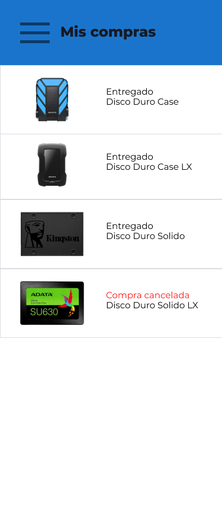

<h1> Go Bedu Shopping </h1>

## ¿Qué es Go Bedu Shopping?

Go Bedu Shopping es un ecommerce para aplicaciones moviles Android, donde se venden distintos tipos de estilos y ropa de distintas clases y materiales a distintos precios.

## ¿Cómo funciona Go Bedu Shopping?

Hasta el momento se cuentan con 11 vistas, para empezar la vista de carga se veria algo asi:

  

Se le mostrará al usuario una pantalla como esta para que se pueda registrar en nuestra aplicacion:

  

Una vez registrado, la siguiente pantalla aparecerá para que pueda iniciar sesion con las credenciales que agregó en la pantalla de SignIn:

  

En el menú principal se mostrara la informacion mas relevante, habrá un buscador para filtrar la informacion de interes del usuario y las compras recomendadas asi como alguna clasificacion para que el usuario pueda navegar a sus contenidos de interes:

  

El usuario podrá seleccionar los articulos y ver la informacion mas relevante de estos, asi como añadir al carrito, a favoritos, seleccionar talla, cantidad entre otras opciones, como se muestra en la siguiente imagen:

  

La pantalla donde el usuario agrega sus productos a su lista de favoritos o de deseos se ve algo asi:

  

Igualmente la pantalla donde este podra ver los articulos que ha añadido al carrito de compra se ve algo asi:

  

El usuario podrá visualizar su información de perfil  asi como otra informacion importante, como cupones o cosas por el estilos

  

Una vez que el usuario haya seleccionado la opcion de pagar, se le mostrará al usuario una pantalla como esta:

  

El usuario tambien podrá ser capaz de visualizar las compras que ha realizado a partir de que se registró en la aplicacion

  

Tambien se tiene una vista para poder navegar entre las distintas categorias de articulos que estan disponibles en la aplicacion

  

En el siguiente diagrama de flujo se muestra la navegacion de la applicacion en un caso de uso real:

  

## Features

GO BEDU SHOPPING es desarrollada usando tecnologías como:

- :iphone: **Kotlin**: La mayoria del desarrollo de esta aplicacion fué construído en Kotlin.

- :computer: *Java*: Para demostrar la interoperabilidad con Kotlin se agregaron algunas funcionalidades de Java al proyecto.

- :gear: **Best Practices**: Flujo de trabajo sólido para mantener el código limpio y estructurado.

## ¿Quienes mantienen y contribuyen a BEDU MUSIC?

|  Elias Bautista|  Paulina Quintero|  Gabriel Balbuena|  Ali Villegas ||
| --- | --- | --- | --- | --- |
| elias.bautistaflores@outlook.com | paulina.mucito@gmail.com | agbalbuenaluna@gmail.com | ali.villegas.aquino@gmail.com |

 

¡GRACIAS POR USAR GO BEDU SHOPPING!
