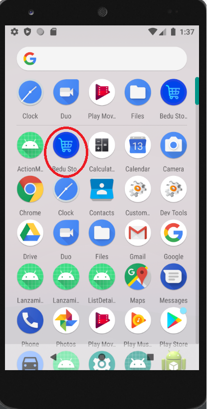

<h1> BEDU STORE </h1>

## ¿Qué es Bedu Store?

Bedu Store es un e-commerce para dispositivos móviles Android en donde se venden distintos tipos de artículos para hombres, mujeres y niños. Para iniciar sesión se requiere de una cuenta registrada con la cual el usuario podrá visualizar información relevante de los artículos,
explorar las categorias, añadir productos al carrito de compras, añadir productos a favoritos, iniciar un proceso de compra y visualizar información de su cuenta.

## Alcances del proyecto

Procurando que la realización del proyecto no sea muy complejo y que se alcancen a cubrir los requisitos, temas y propositos de aprendizaje, se establecieron ciertos alcances para las acciones que se podrán realizar a través de la aplicación.
De esta manera, se definió que las acciones básicas a implementar serán las siguientes:
- Iniciar sesión (para usuarios ya registrados).
- Registrar una nueva cuenta de usuario.
- Navegar entre distintas categorias de usuario dependiendo de sus intereses.
- Ver detalles de un producto.
- Agregar productos a la sección de favoritos.
- Agregar y eliminar productos al carrito de compras.
- Iniciar un proceso de pago de artículos.
- Ver una lista de las compras realizadas previamente.
- Ver el perfil del usuario.
- Cerrar sesión.

## ¿Cómo funciona Bedu Store?

Al instalar la aplicación en tu dispositivo móvil podrás identificarla fácilmente junto a tus otras aplicaciones, esto gracias a su icono característico como se muestra en la siguiente imagen. Es importante destacar que el logo de Bedu Store se caracteriza por ser de color azul que contiene un carrito de supermercado:

  

Al ejecutar la aplicación por primera vez (en su inicio del ciclo de vida) se mostrará una pantalla de bienvenida como se observa a continuación:

  

Una vez iniciada la aplicación, se le pedirá al usuario que Inicie Sesión con sus credenciales ya registradas. [Aqui](#credenciales) puedes encontrar dichas credenciales que hemos creado para que puedas comenzar a utilizar Bedu Store:

  

La vista anterior también proporciona la posibilidad de registrarte en caso de que no tengas una cuenta. En esta vista podrás insertar datos relevantes que serán necesarios para recabar la información de los usuarios como: nombre completo, correo electrónico, nombre de usuario y contraseña.
  
Al dar click al enlace de registro de cuenta, la pantalla que se mostrará es la siguiente:

  

Una vez ingresadas las credenciales del usuario root se dirigirá hacia la pantalla principal de la aplicación o pantalla home. En el menu superior de esta vista se muestra una barra de búsqueda y en el contenido se presenta la sección de categorias de la app
que se divide en hombres, mujeres y niños, además, hay un slider del público al que va dirigida la aplicación y más abajo hay un apartado de promocionales y publicaciones propias:

  

Desde esa vista, al dar click en cualquiera de las categorias se mostrará un listado de productos para cada una de las categorias. A continuación, se muestran cada unas de las categorias y sus productos correspondientes:
 
### Menú Hombres

  

### Menú Mujeres

  

### Menú Niños

  

Desde cualquiera de las listas de productos de cada una de las categorias existen dos opciones. La primera es dar click directamente al icono del corazón, acción que llevará al usuario a la pantalla de Favoritos
y se añadirá el producto en una lista donde se marcarán todos los artículos que el usuario quiera dejar fijados como productos para comprar después (similar a una lista de deseos) y asi el usuario no pueda
perder de vista sus artículos favoritos para más tarde añadirlos al carrito o bien, comprarlos.

  

Una vez añadido el producto en la vista de favoritos, el artículo se mostrará de la siguiente manera.

  

Regresando a la vista de artículos, como seguna opción se le puede dar click directamente al producto, lo cual llevará al usuario a una pantalla donde se mostrarán los detalles del articulo, además de fotografias, una calificación,
descripción, costo, se podrá seleccionar la cantidad a comprar, se podrán visualizar las especificaciones de las tallas, asi como un estimado de días para la entrega del producto en cuestión.

  

  

Un aspecto a destacar de la aplicación es que para navegar a través de esta no sólo se puede realizar mediante botones que te lleven de una pantalla a otra en lugares específicos, pues también se cuenta con un menú de navegación entre las vistas mas importantes de la aplicación, entre ellas están las pantallas de home y favoritos, que ya se han mencionado anteriormente, asi como las vistas de mi carrito
y mi cuenta.

  

En la pantalla de mi carrito, el usuario podrá encontrar de manera directa los artículos que haya cargado a este para poder realizar su compra posteriormente. Esta pantalla se muestra a continuación:

  

Desde esta pantalla se pueden realizar algunas acciones tales como borrar los artículos añadidos:

  

  

También desde la vista de mi carrito se puede iniciar un proceso de simulación de pago:

  

En seguida se muestra otra de las pantallas principales de la aplicación. Esta corresponde a la pantalla de Mi cuenta, en la cual se proporciona la información del usuario,
como es su nombre, telefono celular, fotografia y correo electrónico, además de su información en base a la interacción que ha tenido con la app, tal como total de compras y puntos obtenidos en este periodo:

  

A partir de la pantalla anterior, al dar click a la vista de mis compras, se mostrará el historial de las compras realizadas por el usuario desde que se registró a la app:

  

Si regresamos a la vista de Mi cuenta, existe otra opción, que es la de cerrar sesión. Una vez dada la confirmación del usuario, la aplicacion volverá a mostrar la pantalla de iniciar sesión
para que este vuelva a insertar sus credenciales de usuario y el proceso regrese de inicio de sesión comience nuevamente...

  

Para estilizar la aplicación y mejorar la experiencia de usuario se agregaron algunos loaders y spinners, esto para simular la carga de datos de la consulta de un backend real. Aqui se muestran un ejemplo:

  

## ¿Cual es el flujo normal de Bedu Store?

En el siguiente diagrama de flujo se muestra la navegacion de la applicacion en un caso de uso real:

  

Visto desde otra perspectiva, el flujo de navegación del usuario es como se muestra en el siguiente esquema utilizando los Mockups que inicialmente se habían diseñado:

  

## ¡¡IMPORTANTE!!

**Nombre de usuario:** root
 
**Contraseña:** 1234

## Features

Bedu Store es desarrollada usando tecnologías como:

- :iphone: **Kotlin**: El lenguaje de desarrollo utilizado para la construccion del proyecto fué Kotlin.

- :art: **XML**: La parte de diseño se utilizó el lenguaje de marcado XML.

- :gear: **Best Practices**: Flujo de trabajo sólido para mantener el código limpio y estructurado.

- :bulb: **Figma**: Vistas siguiendo las especificaciones para obtener una UI amigable para el usuario.

## ¿Cómo fué construído Bedu Store?
Para la construcción de esta aplicación se implementaron todos los temas vistos en el Modulo de Kotlin Intermedio, se siguieron las buenas prácticas y se realizaron los diseños correspondientes
a cada una de las pantallas en Figma, siguiendo los consejos y especificaciones del modulo de UI Fundamentals asi como los conocimientos adquiridos a lo largo del modulo de Kotlin fundamentals.
Este proyecto contiene temas como:
- Views (Constraint, LinearLayout, RelativeLayout, FrameLayout, etc)
- Activities y Layouts
- Listas
- Fragments
- Material Design
- Menus
- Styles

Tambien se hizo uso de algunas librerias externas, para mas referencias de estas se adjuntan algunos links

* https://github.com/smarteist/Android-Image-Slider
* https://material.io/components
* https://square.github.io/picasso/
* https://github.com/denzcoskun/ImageSlideshow

## ¿Quienes mantienen y contribuyen a Bedu Store?

|  Elias Bautista|  Paulina Quintero|  Gabriel Balbuena|  Ali Villegas ||
| --- | --- | --- | --- | --- |
| elias.bautistaflores@outlook.com | paulina.mucito@gmail.com | agbalbuenaluna@gmail.com | ali.villegas.aquino@gmail.com |

 

¡GRACIAS POR USAR BEDU STORE!
